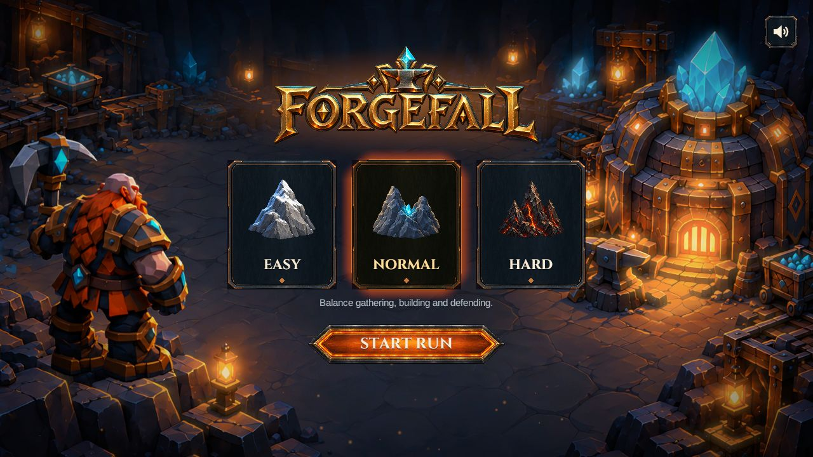
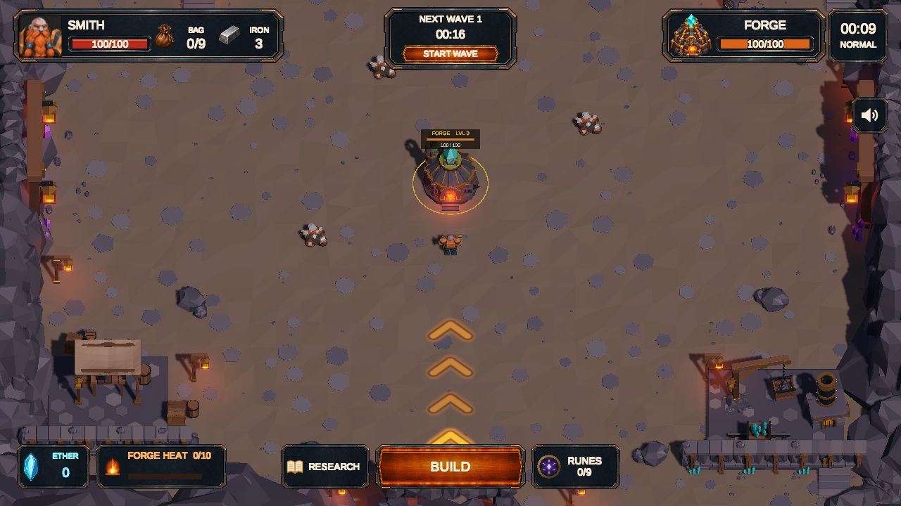

# Forgefall — Unity Gameplay Portfolio

An AI-assisted Unity game combining mining, tower defense and roguelite progression. Control a dwarven smith, gather iron, supply a central Forge and build defenses against increasingly dense waves.

**Stack:** C# · Unity 6000.6.0f1 · URP 17.6.0 · Input System 1.20.0 · uGUI · WebGL / IL2CPP

**Development workflow:** developed with AI assistance. The code samples and technical notes below show the actual project implementation and its tradeoffs; they are not presented as code written entirely without AI.

## Start here

For a quick technical review, follow these three examples:

| Example | What to inspect | Entry point |
| --- | --- | --- |
| Hex power network | Graph traversal, axial coordinates, disconnected cycles, overlapping coverage | [RelayConnectivity.cs](Samples/Forge/RelayConnectivity.cs) · [guide](docs/power-network.md) |
| Endless waves | Data-driven configuration, deterministic lane scheduling, boss growth and bounds | [EndlessWaveGenerator.cs](Samples/Waves/EndlessWaveGenerator.cs) · [guide](docs/endless-waves.md) |
| Health and damage | Damage attribution, policy injection, state mutation and event ordering | [Health.cs](Samples/Combat/Health.cs) · [guide](docs/health.md) |

The seven production C# files are copied unchanged from a single project snapshot. [Focused EditMode tests](Tests/Editor/RelayConnectivityTests.cs) adapt the existing project's pure graph checks for this extract.

For the larger picture, read the [architecture overview](docs/architecture.md) and the [WebGL optimization case study](docs/web-performance.md).

## Game loop

1. Mine iron and carry it back to the Forge.
2. Place turrets on a logical hex grid. Relays extend the Forge's connected power network.
3. Defend against timed waves, elites and bosses.
4. Spend Ether on research, choose runes and unlock turret upgrade branches.
5. Continue into endless mode or finish the run during preparation.

The full game includes three difficulty profiles, four turret archetypes with upgrade branches, rune choices, research progression, run statistics, tutorial flow and a WebGL release pipeline.

Screenshots above are from the actual local WebGL release validation on October 5, 2026. The gameplay image shows the opening preparation phase, not a staged combat encounter.

## Scope and source provenance

This is a portfolio extract, not the complete Unity game. Scenes, prefabs, models, textures, audio, authored balance assets and the private game's Git history are not included. There is no published playable demo or video linked in this snapshot.

Production snapshot: `96836dac69469bf79ebe6c22f0fd6f098ecb7f74`, exported October 6, 2026. [Source manifest](docs/source-manifest.json) records original paths and SHA-256 hashes. References to other game classes in source comments explain integration; those classes are intentionally outside the extract.

The sample source needs Unity's assemblies. It is not a standalone .NET application. To inspect or run the graph tests in a fresh Unity project, follow the [sample setup and validation notes](docs/validation.md).

## Review topics

- Separation between Unity scene components, data assets and gameplay algorithms.
- Deterministic wave generation and preservation of authored early waves.
- Power-network behavior when bridges are removed or restored.
- Damage attribution and the ordering of notifications after state changes.
- Measured WebGL bottlenecks and the cost of visual fidelity versus enemy density.

Repository maintained by [@serjikcod4](https://github.com/serjikcod4). See [NOTICE](NOTICE.md) for publication scope and usage notice.
