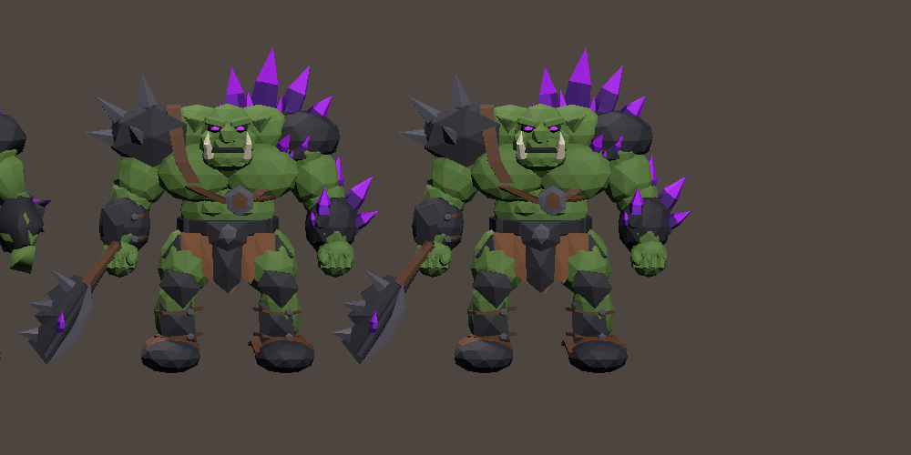

# WebGL optimization case study

This is a summary of recorded local project measurements from September 30 and October 5, 2026. The benchmarks were not rerun to prepare this repository. They are not a cross-device performance guarantee.

## Late-wave rendering cost

A stress scenario combined a large orc crowd with relay and turret defenses. In the recorded Editor profile, consolidating each orc's twelve materials into one reduced draw calls from 25,310 to 4,545 at the same 12.8 million triangles. Later changes included tangent-free meshes, one-bone skinning and a 10 Hz turret aiming scan between shots; the firing frame still performs a fresh scan.

On the recorded Chromium WebGL setup with 312 living enemies, the one-material build measured 11.1 FPS. The tangent-free build with the aiming change measured 16.9 FPS. Hiding enemy meshes produced a much larger improvement than toggling shadows or disabling turret updates, pointing to skinned-mesh rendering as the main bottleneck in that setup.

The chosen final configuration combined a lower-detail orc mesh with a runtime cap of 150 living enemies; the rest of each wave waits for deaths before spawning. It measured 33.4 FPS in the recorded stress setup. This comparison changes both mesh cost and concurrency, so it does not isolate either change's contribution.

The concurrency cap is a gameplay tradeoff: late waves take longer, and the crowded battlefield differs from the 312-enemy case. Enemy count is not simply removed from the generated wave.

## Startup download

The October 5 local WebGL release separated the interactive start screen from deferred gameplay/resource bundles and loaded music on demand. The recorded initial payload, including HTML, was 12.479 MB instead of the earlier 32.369 MB, approximately 61.45% smaller.

The complete payload was still 55.137 MB. Some bundle content duplicated shared dependencies; deferred delivery reduced initial bytes, not total content. The release used Brotli with correct local Content-Encoding headers, medium managed stripping and IL2CPP size optimization.

## Evidence limits

The project's local release report recorded successful compilation, start-screen rendering, entry into a Normal run, retry after a simulated resource-load failure, restart and change-difficulty flows. Portal delivery and load-time metrics were not measured. Safari, mobile, all difficulty playthroughs and full late-wave behavior were outside that release validation.

The underlying private reports are `Docs/AI/PerformanceProfiling.md` and `Docs/AI/CrazyGamesWebValidation_2026-10-05.md`. They are named for traceability, not published here with internal logs or local environment details.
